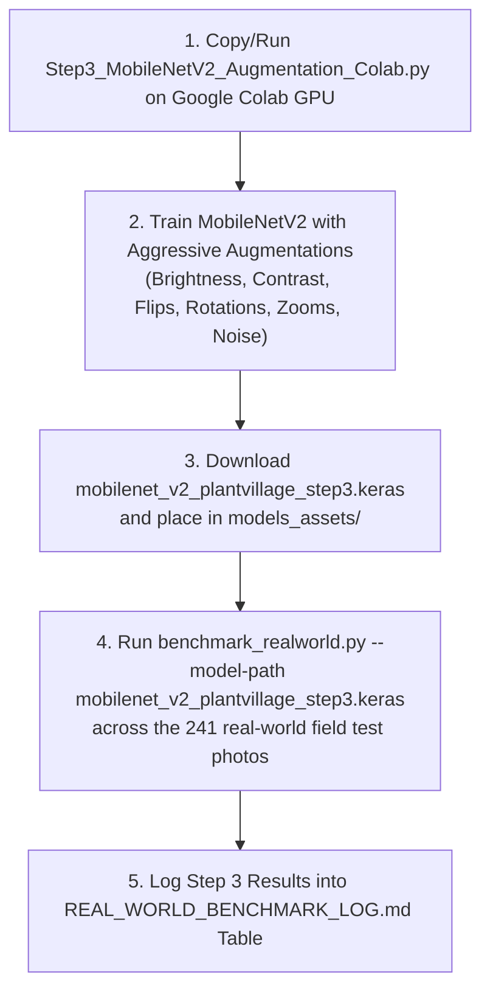

# Implementation Plan: Step 3 Aggressive Data Augmentation Training & Benchmark Protocol

You are **100% correct!** Training MobileNetV2 on 50,000+ PlantVillage images is exponentially faster on Google Colab's T4 GPU (~5-10 minutes) than locally on CPU. 

---

## 🔬 Step 3 Protocol & Execution Workflow

---

## 📊 Complete Benchmark Tracking Table

| Step | Milestone / Technique | Real-World Top-1 Acc | Real-World Top-3 Acc | Mean Confidence | Mean Latency | Status |
| :---: | :--- | :---: | :---: | :---: | :---: | :---: |
| **0** | **Baseline (Lab Model)** | **24.90%** (60/241) | **49.79%** (120/241) | 80.60% | 129.1 ms | ✅ Completed |
| **1** | **+ Spatial TTA (5 Views)** | **27.39%** (66/241) | **53.53%** (129/241) | 67.17% | 197.7 ms | ✅ Completed |
| **2** | **+ Background Removal (`rembg`)** | **24.48%** (59/241) | **41.08%** (99/241) | 83.94% | 3047.3 ms | ❌ Rejected (White void mismatch) |
| **3** | **+ Aggressive Training Augment** | *Pending Colab Train* | *Pending Colab Train* | *TBD* | ~129 ms | ⏳ Ready for Colab |
| **4** | **+ PlantDoc Dataset Expansion** | *Upcoming Step 4* | *Upcoming Step 4* | *TBD* | ~129 ms | ⏳ Pending Step 3 |

---

## Step 3 Google Colab Script Features

The script [`Step3_MobileNetV2_Augmentation_Colab.py`](file:///d:/Projects/AI-ML%20Portfolio/Potato_disease/Step3_MobileNetV2_Augmentation_Colab.py) includes:

1. **Base Dataset**: Full PlantVillage 39-class dataset (unchanged).
2. **Aggressive Training-Time Data Augmentations**:
   - `RandomFlip("horizontal_and_vertical")`
   - `RandomRotation(0.2)` (~±10-15° rotation)
   - `RandomZoom(0.2)` (20% zoom variation)
   - `RandomBrightness(factor=0.2)` (±20% lighting variation)
   - `RandomContrast(factor=0.2)` (±20% contrast variation)
   - `GaussianNoise(0.05)` (Simulates camera sensor/focus noise)
3. **No Background Removal**: `rembg` is strictly excluded as rejected in Step 2.
4. **Transfer Learning Pipeline**:
   - **Phase 1**: Base frozen, train classification head (`Adam(1e-3)`).
   - **Phase 2**: Unfreeze top backbone layers, fine-tune (`Adam(1e-5)`).
5. **Output Artifact**: Saves model cleanly as `mobilenet_v2_plantvillage_step3.keras`.
