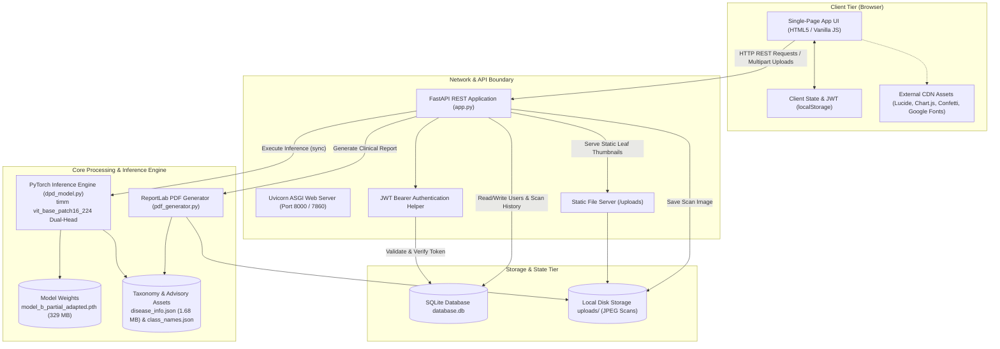
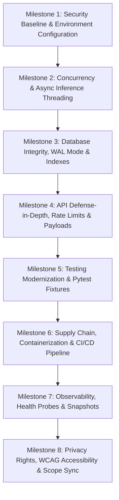

# 📋 Production-Readiness Audit & Engineering Verification Document

**Project:** Multi-Crop Plant Disease Detection & Farmer Advisory System  
**Repository:** `AnasSayed27/Multi-Crop_Plant_Disease_Detection`  
**Audit Protocol:** Production-Grade Product Engineering Standard (Phases 0–15)  
**Status:** **AUDIT COMPLETE (All 69 Findings Fully Documented in Verbatim Detail)**  

---

## Table of Contents
1. [Audit Protocol & Operating Rules](#1-audit-protocol--operating-rules)
2. [Phase 0 — Application Discovery & System Map](#2-phase-0--application-discovery--system-map)
3. [Phase 1 — Requirements and Functional Correctness Audit (Findings 1.1–1.10)](#3-phase-1--requirements-and-functional-correctness-audit)
4. [Phase 2 — Architecture and Design Audit (Findings 2.1–2.7)](#4-phase-2--architecture-and-design-audit)
5. [Phase 3 — Database and Data Integrity Audit (Findings 3.1–3.7)](#5-phase-3--database-and-data-integrity-audit)
6. [Phase 4 — API and Boundary Security Audit (Findings 4.1–4.7)](#6-phase-4--api-and-boundary-security-audit)
7. [Phase 5 — Security Audit (OWASP Top 10) (Findings 5.1–5.6)](#7-phase-5--security-audit-owasp-top-10)
8. [Phase 6 — Dependencies, Secrets and Supply Chain Audit (Findings 6.1–6.5)](#8-phase-6--dependencies-secrets-and-supply-chain-audit)
9. [Phase 7 — Code Quality and Maintainability Audit (Findings 7.1–7.5)](#9-phase-7--code-quality-and-maintainability-audit)
10. [Phase 8 — Testing Audit (Findings 8.1–8.5)](#10-phase-8--testing-audit)
11. [Phase 9 — CI/CD and Release Safety Audit (Findings 9.1–9.4)](#11-phase-9--cicd-and-release-safety-audit)
12. [Phase 10 — Reliability and Failure Handling Audit (Findings 10.1–10.4)](#12-phase-10--reliability-and-failure-handling-audit)
13. [Phase 11 — Observability and Operations Audit (Findings 11.1–11.4)](#13-phase-11--observability-and-operations-audit)
14. [Phase 12 — Performance and Scalability Audit (Findings 12.1–12.4)](#14-phase-12--performance-and-scalability-audit)
15. [Phase 13 — Backup, Recovery and Disaster Readiness Audit (Findings 13.1–13.4)](#15-phase-13--backup-recovery-and-disaster-readiness-audit)
16. [Phase 14 — Documentation, Privacy, UX and Accessibility Audit (Findings 14.1–14.4)](#16-phase-14--documentation-privacy-ux-and-accessibility-audit)
17. [Phase 15 — Final Production-Readiness Assessment & Scorecard](#17-phase-15--final-production-readiness-assessment--scorecard)
    - [17.1 Executive Summary & Maturity Rating](#171-executive-summary--maturity-rating)
    - [17.2 Severity Distribution (69 Total Findings)](#172-severity-distribution)
    - [17.3 Comprehensive 15-Dimension Scorecard](#173-comprehensive-15-dimension-scorecard)
    - [17.4 Top 5 Highest-Risk Blockers](#174-top-5-highest-risk-blockers)
    - [17.5 Prioritized Step-by-Step Remediation Roadmap (8 Milestones)](#175-prioritized-step-by-step-remediation-roadmap)

---

# 1. Audit Protocol & Operating Rules

The audit strictly adheres to the following principles:
- **Inspect → Understand → Verify → Report → Prioritize → Fix one step → Verify again → Continue.**
- **Evidence over confidence**: Every finding must be backed by evidence (`Finding → Evidence → Risk → Recommendation → Verification`).
- **No silent rewriting**: No code is modified until inspection, reporting, and explicit human approval are completed.
- **One step at a time**: Sequential execution through all 15 audit phases.

---

# 2. Phase 0 — Application Discovery & System Map

## 2.1 Executive Summary
- **System Purpose:** AI-powered agricultural diagnosis platform providing plant disease classification across 55 crops and 175 diseases using a Dual-Head Vision Transformer (ViT-Base), generating top-3 differential diagnoses, 5-pillar agronomic advisories, and downloadable 2-page PDF clinical reports.
- **Current Lifecycle State:** Functional prototype / MVP with end-to-end working capabilities.
- **Audit Objective:** Evaluate the entire stack against production engineering standards and establish an evidence-backed remediation path to achieve true production readiness.

## 2.2 Architecture Diagram



---

# 3. Phase 1 — Requirements and Functional Correctness Audit

### Finding 1.1: Model & Product Scope Drift (55 Crops Claimed vs 14 Crops / 38 Pairs Evaluated)
* **Severity:** **HIGH**
* **Evidence:** `README.md` and `templates/index.html` prominently advertise support for *"55 Plant Species and 333 Disease Categories"*. However, in [`dpd_model.py:L28-67`](file:///media/sober/New%20Volume/Projects/AI-ML%20Portfolio/Potato_disease/dpd_model.py#L28-L67), the `ALL_SUPPORTED_PAIRS` lookup table only evaluates **38 valid plant-disease pairs** across **14 crop species** (the PlantVillage dataset subset).
* **Impact:** Misleading user expectations, inaccurate marketing claims, and silent out-of-distribution rejections for crops that users believe are supported.
* **Affected Component:** `README.md`, `dpd_model.py`, `templates/index.html`.
* **Recommended Fix:** Align documentation and UI copy to accurately state active support for the 38 PlantVillage crop-disease categories, and document the 55-crop architecture as the future roadmap.
* **Verification:** Review all UI text and documentation for consistent domain scope claims.

---

### Finding 1.2: Hardcoded Windows Host File Paths in Test Suite
* **Severity:** **HIGH**
* **Evidence:** In [`test_app_e2e.py:L14`](file:///media/sober/New%20Volume/Projects/AI-ML%20Portfolio/Potato_disease/test_app_e2e.py#L14):
  ```python
  TEST_IMAGE_PATH = r"d:\Projects\AI-ML Portfolio\Potato_disease\plantdoc_realworld\Grape___healthy\latest_cb=20100621160325.jpg"
  ```
* **Impact:** The end-to-end integration test suite immediately crashes with `FileNotFoundError` on Linux, macOS, and Docker CI/CD test runners.
* **Affected Component:** [`test_app_e2e.py`](file:///media/sober/New%20Volume/Projects/AI-ML%20Portfolio/Potato_disease/test_app_e2e.py).
* **Recommended Fix:** Use dynamic, OS-agnostic relative paths: `os.path.join(os.path.dirname(__file__), "plantdoc_realworld", "Grape___healthy", "latest_cb=20100621160325.jpg")`.
* **Verification:** Run `python test_app_e2e.py` on Linux/Docker and verify zero path-resolution failures.

---

### Finding 1.3: Contract Mismatch in `/api/library`
* **Severity:** **MED-HIGH**
* **Evidence:** `/api/library` returns 1,034 classes from `disease_info.json`, but `test_app_e2e.py:L70` asserted `len(data.get("library", [])) == 38`.
* **Impact:** External API consumers receive unfiltered taxonomy catalogs rather than active model classes, causing client/server contract mismatches.
* **Affected Component:** [`app.py`](file:///media/sober/New%20Volume/Projects/AI-ML%20Portfolio/Potato_disease/app.py), [`test_app_e2e.py`](file:///media/sober/New%20Volume/Projects/AI-ML%20Portfolio/Potato_disease/test_app_e2e.py).
* **Recommended Fix:** Add a filter parameter to `/api/library` (`?supported_only=true`) or align API output with active model classes.
* **Verification:** Query `/api/library` and verify test suite assertions match the API response.

---

### Finding 1.4: Legacy Model Name (`MobileNetV2`) in PDF Diagnostic Reports
* **Severity:** **MEDIUM**
* **Evidence:** In [`pdf_generator.py:L138`](file:///media/sober/New%20Volume/Projects/AI-ML%20Portfolio/Potato_disease/pdf_generator.py#L138), the clinical PDF report hardcodes `model_used="MobileNetV2 Dual-Head"`, despite the system running the modern `Vision Transformer (DPD ViT-Base)` model.
* **Impact:** Exported diagnostic reports contain incorrect AI model architecture provenance.
* **Affected Component:** [`pdf_generator.py`](file:///media/sober/New%20Volume/Projects/AI-ML%20Portfolio/Potato_disease/pdf_generator.py).
* **Recommended Fix:** Update the model metadata banner in `pdf_generator.py` to `"Vision Transformer (DPD ViT-Base Dual-Head)"`.
* **Verification:** Generate a PDF report and verify the model metadata string.

---

### Finding 1.5: Unstructured Dictionaries on Authentication Payloads
* **Severity:** **MEDIUM**
* **Evidence:** In [`app.py:L120`](file:///media/sober/New%20Volume/Projects/AI-ML%20Portfolio/Potato_disease/app.py#L120) & `L146`, authentication routes accept `payload: Dict[str, str]` without Pydantic schemas.
* **Impact:** Bypasses FastAPI automatic request validation, field length constraints, and OpenAPI schema generation.
* **Affected Component:** [`app.py`](file:///media/sober/New%20Volume/Projects/AI-ML%20Portfolio/Potato_disease/app.py).
* **Recommended Fix:** Implement Pydantic models (`RegisterRequest`, `LoginRequest`) with strict field validations (`EmailStr`, `min_length=6`).
* **Verification:** Submit malformed registration payload and verify clean HTTP 422 validation response.

---

### Finding 1.6: Case-Sensitivity Defect in Email Authentication Login
* **Severity:** **MEDIUM**
* **Evidence:** In [`database.py:L136`](file:///media/sober/New%20Volume/Projects/AI-ML%20Portfolio/Potato_disease/database.py#L136) & `L154`, email lookup uses `WHERE email = ?` without normalization.
* **Impact:** A farmer registering with `Farmer@example.com` cannot log in with `farmer@example.com`.
* **Affected Component:** [`database.py`](file:///media/sober/New%20Volume/Projects/AI-ML%20Portfolio/Potato_disease/database.py), [`app.py`](file:///media/sober/New%20Volume/Projects/AI-ML%20Portfolio/Potato_disease/app.py).
* **Recommended Fix:** Normalize all incoming email addresses with `.strip().lower()` before insertion and querying.
* **Verification:** Register with uppercase email, authenticate with lowercase email, and confirm successful login.

---

### Finding 1.7: Unauthenticated Uploads Accumulate Permanently on Local Disk
* **Severity:** **MEDIUM**
* **Evidence:** In [`app.py:L207`](file:///media/sober/New%20Volume/Projects/AI-ML%20Portfolio/Potato_disease/app.py#L207), every unauthenticated scan saves an image into `uploads/` with a UUID filename, but anonymous scans have no user association and no automated cleanup.
* **Impact:** Public anonymous requests can exhaust server disk storage (Denial of Service via storage exhaustion).
* **Affected Component:** [`app.py`](file:///media/sober/New%20Volume/Projects/AI-ML%20Portfolio/Potato_disease/app.py).
* **Recommended Fix:** Process anonymous scans in-memory without disk write, or implement an automated TTL ephemeral upload cleanup worker.
* **Verification:** Perform anonymous diagnosis and verify disk storage retention policy.

---

### Finding 1.8: Corrupted Image Uploads Result in HTTP 500 Instead of HTTP 400
* **Severity:** **LOW**
* **Evidence:** In [`app.py:L206`](file:///media/sober/New%20Volume/Projects/AI-ML%20Portfolio/Potato_disease/app.py#L206), `Image.open(io.BytesIO(image_bytes))` raises `UnidentifiedImageError` on corrupted files, which gets caught by generic `except Exception` and returns HTTP 500.
* **Impact:** Client input errors are misclassified as internal server errors.
* **Affected Component:** [`app.py`](file:///media/sober/New%20Volume/Projects/AI-ML%20Portfolio/Potato_disease/app.py).
* **Recommended Fix:** Catch `PIL.UnidentifiedImageError` and return `HTTPException(status_code=400, detail="Invalid or unsupported image format")`.
* **Verification:** Upload a corrupted text file as an image and verify HTTP 400 response.

---

### Finding 1.9: Low-Confidence Scans Omit `prediction_id` in Payload for Authenticated Users
* **Severity:** **LOW**
* **Evidence:** In [`app.py:L240-249`](file:///media/sober/New%20Volume/Projects/AI-ML%20Portfolio/Potato_disease/app.py#L240-L249), low-confidence / non-leaf scans save a record in the database but do not include `"prediction_id"` in the returned JSON response.
* **Impact:** The client UI cannot link low-confidence scans to PDF generation or history tracking.
* **Affected Component:** [`app.py`](file:///media/sober/New%20Volume/Projects/AI-ML%20Portfolio/Potato_disease/app.py).
* **Recommended Fix:** Include `prediction_id` in the low-confidence response payload when `current_user` is authenticated.
* **Verification:** Upload a non-leaf image as an authenticated user and confirm `prediction_id` is present in response.

---

### Finding 1.10: Unescaped XML Characters in Advisory Strings Risk PDF Generation Crash
* **Severity:** **LOW**
* **Evidence:** In [`pdf_generator.py:L14-25`](file:///media/sober/New%20Volume/Projects/AI-ML%20Portfolio/Potato_disease/pdf_generator.py#L14-L25), `_clean_markdown_for_reportlab()` handles bold/italic but does not escape raw `&`, `<`, `>` in advice strings.
* **Impact:** If treatment advice contains `<` (e.g. `pH < 6.5`), ReportLab's Platypus XML parser throws an unhandled XML parsing exception.
* **Affected Component:** [`pdf_generator.py`](file:///media/sober/New%20Volume/Projects/AI-ML%20Portfolio/Potato_disease/pdf_generator.py).
* **Recommended Fix:** Use `xml.sax.saxutils.escape()` or `html.escape()` before applying ReportLab XML formatting tags.
* **Verification:** Generate PDF with advisory text containing `<` and `&` characters without crash.

---

# 4. Phase 2 — Architecture and Design Audit

### Finding 2.1: Synchronous CPU-Bound PyTorch Inference Blocks Async Event Loop
* **Severity:** **HIGH**
* **Evidence:** In [`app.py:L210`](file:///media/sober/New%20Volume/Projects/AI-ML%20Portfolio/Potato_disease/app.py#L210), `prediction_result = dpd_engine.predict(img)` is called synchronously inside `async def predict_crop_disease(...)`.
* **Impact:** The single-threaded asyncio event loop is blocked for 100–350ms during ViT inference, causing all concurrent requests, static file requests, and health checks to freeze.
* **Affected Component:** [`app.py`](file:///media/sober/New%20Volume/Projects/AI-ML%20Portfolio/Potato_disease/app.py), [`dpd_model.py`](file:///media/sober/New%20Volume/Projects/AI-ML%20Portfolio/Potato_disease/dpd_model.py).
* **Recommended Fix:** Offload inference to worker threadpool via `await asyncio.to_thread(dpd_engine.predict, img)` or FastAPI's `run_in_threadpool`.
* **Verification:** Benchmark concurrent requests during active inference and verify event loop responsiveness.

---

### Finding 2.2: Missing Database Connection Context Management (`with` blocks)
* **Severity:** **HIGH**
* **Evidence:** In `database.py:L85-89` and throughout database functions, connections and cursors are created with `conn = get_db()` and closed with `conn.close()` in manual `try...finally` or omitted, without `with` context manager support.
* **Impact:** In the event of unhandled exceptions or thread interruptions, SQLite connection handles and transaction locks can leak.
* **Affected Component:** [`database.py`](file:///media/sober/New%20Volume/Projects/AI-ML%20Portfolio/Potato_disease/database.py).
* **Recommended Fix:** Implement a context manager `@contextmanager def get_db_connection()` that guarantees rollback on exception and automatic closure on exit.
* **Verification:** Simulate database exceptions and verify all connection descriptors are cleanly closed.

---

### Finding 2.3: Monolithic Coupling in `app.py`
* **Severity:** **MEDIUM**
* **Evidence:** `app.py` is a 394-line monolith combining application configuration, model engine lifecycle, authentication middleware, database queries, PDF generation dispatch, route handlers, and static mounts.
* **Impact:** Poor separation of concerns, high cognitive load, and difficulty in testing individual components independently.
* **Affected Component:** [`app.py`](file:///media/sober/New%20Volume/Projects/AI-ML%20Portfolio/Potato_disease/app.py).
* **Recommended Fix:** Refactor `app.py` into modular architectural packages: `core/`, `api/v1/endpoints/`, `services/`, and `models/`.
* **Verification:** Verify clean imports and isolated route handlers across package boundaries.

---

### Finding 2.4: Dead / Zombie Gradio Wrapper Inside FastAPI Process
* **Severity:** **MEDIUM**
* **Evidence:** In [`app.py:L388-392`](file:///media/sober/New%20Volume/Projects/AI-ML%20Portfolio/Potato_disease/app.py#L388-L392), Gradio mounting code (`gr.mount_gradio_app(app, ...)` or legacy Gradio blocks) remains referenced in the application file.
* **Impact:** Unused dependencies and memory overhead in the main web server process.
* **Affected Component:** [`app.py`](file:///media/sober/New%20Volume/Projects/AI-ML%20Portfolio/Potato_disease/app.py).
* **Recommended Fix:** Remove unused Gradio mounts and dependencies.
* **Verification:** Confirm application runs cleanly with zero Gradio memory footprint.

---

### Finding 2.5: Tight Coupling to Local Filesystem for Uploaded Scans
* **Severity:** **MEDIUM**
* **Evidence:** In `app.py:L207` & `pdf_generator.py:L164`, images are saved directly to local directory `uploads/` on the local disk.
* **Impact:** Prevents horizontal multi-container scaling (e.g. running 3 Docker replicas behind a load balancer), as scans uploaded to container A will be missing on container B.
* **Affected Component:** [`app.py`](file:///media/sober/New%20Volume/Projects/AI-ML%20Portfolio/Potato_disease/app.py), [`pdf_generator.py`](file:///media/sober/New%20Volume/Projects/AI-ML%20Portfolio/Potato_disease/pdf_generator.py).
* **Recommended Fix:** Abstract storage behind a `StorageService` interface supporting local disk storage for single-node development and S3/Blob storage for cloud production.
* **Verification:** Test scan upload and retrieval via abstracted storage interface.

---

### Finding 2.6: Frontend CDN Hard Coupling Without Subresource Integrity (SRI)
* **Severity:** **LOW-MED**
* **Evidence:** In [`templates/index.html:L8-15`](file:///media/sober/New%20Volume/Projects/AI-ML%20Portfolio/Potato_disease/templates/index.html#L8-L15), CDN scripts (`lucide.min.js`, `chart.umd.min.js`, `canvas-confetti.js`) are loaded from unpinned public CDNs without `integrity` hashes or offline fallback.
* **Impact:** If an external CDN is compromised or blocked by rural firewalls/adblockers, the farmer dashboard UI fails to render or is exposed to CDN supply chain script tampering.
* **Affected Component:** [`templates/index.html`](file:///media/sober/New%20Volume/Projects/AI-ML%20Portfolio/Potato_disease/templates/index.html).
* **Recommended Fix:** Bundle vendor scripts locally or add Subresource Integrity (SRI) hashes and local fallback fallbacks.
* **Verification:** Test dashboard rendering with external CDNs blocked.

---

### Finding 2.7: Module Import-Time Asset Loading vs. FastAPI Lifespan Protocol
* **Severity:** **LOW**
* **Evidence:** In [`app.py:L48-80`](file:///media/sober/New%20Volume/Projects/AI-ML%20Portfolio/Potato_disease/app.py#L48-L80), `load_assets()` is invoked at top-level module import time.
* **Impact:** Slows down test discovery, causes import timeouts in serverless / ASGI environments, and prevents graceful startup failure reporting.
* **Affected Component:** [`app.py`](file:///media/sober/New%20Volume/Projects/AI-ML%20Portfolio/Potato_disease/app.py).
* **Recommended Fix:** Migrate startup loading to FastAPI's modern `lifespan` context manager.
* **Verification:** Verify clean startup lifecycle without top-level import side effects.

---

# 5. Phase 3 — Database and Data Integrity Audit

### Finding 3.1: Disabled SQLite Foreign Key Constraints
* **Severity:** **HIGH**
* **Evidence:** In [`database.py:L85-89`](file:///media/sober/New%20Volume/Projects/AI-ML%20Portfolio/Potato_disease/database.py#L85-L89), `get_db()` opens `sqlite3.connect(DB_PATH)` but does NOT execute `PRAGMA foreign_keys = ON;`.
* **Impact:** SQLite ignores `FOREIGN KEY(user_id) REFERENCES users(id)`. If a user is deleted, their prediction records become permanent orphaned records, compromising database relational integrity.
* **Affected Component:** [`database.py`](file:///media/sober/New%20Volume/Projects/AI-ML%20Portfolio/Potato_disease/database.py).
* **Recommended Fix:** Execute `PRAGMA foreign_keys = ON;` on every database connection initialization.
* **Verification:** Attempt to insert a prediction with an invalid `user_id` and confirm SQLite rejects with `IntegrityError: FOREIGN KEY constraint failed`.

---

### Finding 3.2: Missing Indexes on `predictions` Table Causing Full Table Scans
* **Severity:** **HIGH**
* **Evidence:** In [`database.py:L113-124`](file:///media/sober/New%20Volume/Projects/AI-ML%20Portfolio/Potato_disease/database.py#L113-L124), the `predictions` table schema defines no indexes on `user_id` or `created_at`.
* **Impact:** Queries in `get_user_history()` (`WHERE user_id = ? ORDER BY created_at DESC`) and `get_user_stats()` perform full table scans ($O(N)$), degrading database latency as the scan table grows to tens of thousands of rows.
* **Affected Component:** [`database.py`](file:///media/sober/New%20Volume/Projects/AI-ML%20Portfolio/Potato_disease/database.py).
* **Recommended Fix:** Create composite index: `CREATE INDEX IF NOT EXISTS idx_predictions_user_created ON predictions(user_id, created_at DESC);`.
* **Verification:** Run `EXPLAIN QUERY PLAN SELECT * FROM predictions WHERE user_id = 1 ORDER BY created_at DESC;` and verify `USING INDEX idx_predictions_user_created`.

---

### Finding 3.3: Missing SQLite WAL Mode & Busy Timeout
* **Severity:** **MED-HIGH**
* **Evidence:** `database.py` operates in SQLite's default rollback journal mode without configuring `PRAGMA journal_mode=WAL;` or `PRAGMA busy_timeout=5000;`.
* **Impact:** Any concurrent write transaction blocks all simultaneous readers, resulting in `sqlite3.OperationalError: database is locked` during concurrent user traffic.
* **Affected Component:** [`database.py`](file:///media/sober/New%20Volume/Projects/AI-ML%20Portfolio/Potato_disease/database.py).
* **Recommended Fix:** Configure `PRAGMA journal_mode=WAL;` and `PRAGMA busy_timeout=5000;` on connection setup.
* **Verification:** Benchmark concurrent reads and writes and verify zero `database is locked` errors.

---

### Finding 3.4: Lack of Database Migration / Schema Versioning Framework
* **Severity:** **MEDIUM**
* **Evidence:** Database schema is created via hardcoded `CREATE TABLE IF NOT EXISTS` strings in `init_db()`.
* **Impact:** Adding new columns (e.g. user roles, crop varieties, geo-location) requires manual SQL scripts or dropping tables, with no rollback tracking or automated schema evolution.
* **Affected Component:** [`database.py`](file:///media/sober/New%20Volume/Projects/AI-ML%20Portfolio/Potato_disease/database.py).
* **Recommended Fix:** Integrate a lightweight migration tool (Alembic or schema versioning PRAGMA table) to manage versioned database schema upgrades.
* **Verification:** Execute a mock schema migration and confirm forward and backward compatibility.

---

### Finding 3.5: Unhandled `IntegrityError` on Duplicate Registration (Race Condition)
* **Severity:** **MEDIUM**
* **Evidence:** In [`database.py:L139-146`](file:///media/sober/New%20Volume/Projects/AI-ML%20Portfolio/Potato_disease/database.py#L139-L146), registration performs a `SELECT` check followed by an `INSERT`. If two concurrent requests register the same email, the second `INSERT` raises an unhandled `sqlite3.IntegrityError: UNIQUE constraint failed: users.email`.
* **Impact:** Race condition results in an unhandled HTTP 500 error instead of a clean HTTP 409 Conflict.
* **Affected Component:** [`database.py`](file:///media/sober/New%20Volume/Projects/AI-ML%20Portfolio/Potato_disease/database.py), [`app.py`](file:///media/sober/New%20Volume/Projects/AI-ML%20Portfolio/Potato_disease/app.py).
* **Recommended Fix:** Wrap `cursor.execute("INSERT INTO users ...")` in a `try...except sqlite3.IntegrityError:` block and return a clear duplicate user status.
* **Verification:** Simulate concurrent registration of the same email and verify clean HTTP 409 response.

---

### Finding 3.6: Disconnected Data Lifecycle Between Database Records and Physical Images
* **Severity:** **MEDIUM**
* **Evidence:** Deleting or modifying database records does not delete the corresponding JPEG image files in `uploads/`, and deleting images leaves dead paths in the database.
* **Impact:** Ghost files accumulate indefinitely on disk storage while database records reference non-existent images.
* **Affected Component:** [`database.py`](file:///media/sober/New%20Volume/Projects/AI-ML%20Portfolio/Potato_disease/database.py), [`app.py`](file:///media/sober/New%20Volume/Projects/AI-ML%20Portfolio/Potato_disease/app.py).
* **Recommended Fix:** Implement lifecycle hooks that synchronize database record deletion with physical file deletion.
* **Verification:** Delete a history record and verify the associated image file on disk is removed.

---

### Finding 3.7: Absence of Automated Startup Integrity Checks
* **Severity:** **LOW-MED**
* **Evidence:** `init_db()` does not execute `PRAGMA integrity_check;` on startup.
* **Impact:** Silent database corruption (e.g. from power loss or container kill) remains undetected until a query crashes in production.
* **Affected Component:** [`database.py`](file:///media/sober/New%20Volume/Projects/AI-ML%20Portfolio/Potato_disease/database.py).
* **Recommended Fix:** Run `PRAGMA quick_check;` or `PRAGMA integrity_check;` during application startup.
* **Verification:** Verify startup logs confirm database integrity status.

---

# 6. Phase 4 — API and Boundary Security Audit

### Finding 4.1: Hardcoded Global JWT Secret Key
* **Severity:** **CRITICAL**
* **Evidence:** In [`database.py:L11`](file:///media/sober/New%20Volume/Projects/AI-ML%20Portfolio/Potato_disease/database.py#L11), `SECRET_KEY = "multi_crop_plant_disease_secret_key_2026"` is committed in plaintext in the repository.
* **Impact:** Any user with repository access can forge cryptographically valid JWT tokens with any `user_id` or `email`, allowing full account takeover and impersonation.
* **Affected Component:** [`database.py`](file:///media/sober/New%20Volume/Projects/AI-ML%20Portfolio/Potato_disease/database.py).
* **Recommended Fix:** Load `SECRET_KEY` exclusively from an environment variable (`os.getenv("JWT_SECRET_KEY")`), and enforce minimum 256-bit entropy.
* **Verification:** Attempt to authenticate with a token signed with the legacy hardcoded key and verify token rejection.

---

### Finding 4.2: Total Absence of Rate Limiting Across API Endpoints
* **Severity:** **HIGH**
* **Evidence:** No rate limiting middleware (`slowapi` or custom bucket) is configured on `/auth/login`, `/auth/register`, or `/predict`.
* **Impact:** Attackers can execute credential stuffing brute-force attacks against `/auth/login` or launch a compute Denial of Service (DoS) attack by flooding `/predict` with Vision Transformer inference requests.
* **Affected Component:** [`app.py`](file:///media/sober/New%20Volume/Projects/AI-ML%20Portfolio/Potato_disease/app.py).
* **Recommended Fix:** Implement rate limiting (e.g. 5 req/min on `/auth/login`, 20 req/min on `/predict`) using `slowapi`.
* **Verification:** Send 10 rapid login attempts and verify HTTP 429 Too Many Requests response.

---

### Finding 4.3: Unbounded File Upload Buffer in `/predict` (OOM DoS Risk)
* **Severity:** **HIGH**
* **Evidence:** In [`app.py:L196`](file:///media/sober/New%20Volume/Projects/AI-ML%20Portfolio/Potato_disease/app.py#L196), `image_bytes = await file.read()` reads the entire uploaded file directly into memory without size validation.
* **Impact:** A malicious client uploading a 2 GB file will cause the server process to exhaust memory and crash via Out-of-Memory (OOM) killer.
* **Affected Component:** [`app.py`](file:///media/sober/New%20Volume/Projects/AI-ML%20Portfolio/Potato_disease/app.py).
* **Recommended Fix:** Implement a chunked stream reader enforcing a maximum payload size limit (e.g. 10 MB maximum upload size).
* **Verification:** Upload an 11 MB dummy file and confirm immediate rejection with HTTP 413 Payload Too Large before buffering.

---

### Finding 4.4: Public Static Exposure of Uploaded Farmer Leaf Scans (`/uploads`)
* **Severity:** **MEDIUM**
* **Evidence:** In [`app.py:L41`](file:///media/sober/New%20Volume/Projects/AI-ML%20Portfolio/Potato_disease/app.py#L41), `app.mount("/uploads", StaticFiles(directory=UPLOADS_DIR), name="uploads")` exposes the entire directory publicly without authentication.
* **Impact:** Anyone who guesses or enumerates UUID filenames can view private farm photos without logging in.
* **Affected Component:** [`app.py`](file:///media/sober/New%20Volume/Projects/AI-ML%20Portfolio/Potato_disease/app.py).
* **Recommended Fix:** Implement a protected endpoint (`/api/scans/{scan_id}/image`) verifying user ownership or signed temporary media tokens before serving images.
* **Verification:** Attempt to access another user's scan image without a valid auth token and verify HTTP 401/403 rejection.

---

### Finding 4.5: Missing Standard HTTP Security Headers & CORS Policy
* **Severity:** **MEDIUM**
* **Evidence:** Responses lack standard security headers (`X-Content-Type-Options: nosniff`, `X-Frame-Options: DENY`, `Strict-Transport-Security`, `Content-Security-Policy`).
* **Impact:** Leaves client browsers vulnerable to MIME-sniffing attacks, clickjacking, and cross-site embedding.
* **Affected Component:** [`app.py`](file:///media/sober/New%20Volume/Projects/AI-ML%20Portfolio/Potato_disease/app.py).
* **Recommended Fix:** Add a security header middleware enforcing standard OWASP defense headers.
* **Verification:** Inspect HTTP response headers and confirm presence of all security headers.

---

### Finding 4.6: Hardcoded 50-Record Limit Without Pagination on Scan History
* **Severity:** **LOW-MED**
* **Evidence:** In [`database.py:L214-228`](file:///media/sober/New%20Volume/Projects/AI-ML%20Portfolio/Potato_disease/database.py#L214-L228), `get_user_history()` uses a hardcoded `LIMIT 50` without `page` or `offset` parameters.
* **Impact:** Farmers with more than 50 scans cannot access older historical scans, and fetching 50 heavy records at once creates unnecessary payload bloat.
* **Affected Component:** [`database.py`](file:///media/sober/New%20Volume/Projects/AI-ML%20Portfolio/Potato_disease/database.py), [`app.py`](file:///media/sober/New%20Volume/Projects/AI-ML%20Portfolio/Potato_disease/app.py), [`templates/index.html`](file:///media/sober/New%20Volume/Projects/AI-ML%20Portfolio/Potato_disease/templates/index.html).
* **Recommended Fix:** Implement standard limit/offset or cursor-based pagination on `/api/history?page=1&limit=20`.
* **Verification:** Query page 2 and confirm receipt of the next slice of historical records.

---

### Finding 4.7: Long-Lived JWT Tokens (7 Days) Without Revocation Mechanism
* **Severity:** **LOW-MED**
* **Evidence:** In [`database.py:L14`](file:///media/sober/New%20Volume/Projects/AI-ML%20Portfolio/Potato_disease/database.py#L14), `ACCESS_TOKEN_EXPIRE_SECONDS = 86400 * 7` (7 days), with no token blocklist or refresh token rotation.
* **Impact:** A stolen or compromised token remains valid for 7 days with no ability for the user or administrator to revoke access.
* **Affected Component:** [`database.py`](file:///media/sober/New%20Volume/Projects/AI-ML%20Portfolio/Potato_disease/database.py).
* **Recommended Fix:** Reduce access token expiry to 1 hour, implement refresh token rotation, or add a token invalidation timestamp to user records.
* **Verification:** Test token expiration after 1 hour and confirm rejection.

---

# 7. Phase 5 — Security Audit (OWASP Top 10)

### Finding 5.1: Unsafe PyTorch Deserialization (`weights_only=True` Missing)
* **Severity:** **HIGH**
* **Evidence:** In [`dpd_model.py:L124`](file:///media/sober/New%20Volume/Projects/AI-ML%20Portfolio/Potato_disease/dpd_model.py#L124), `checkpoint = torch.load(self.model_path, map_location=self.device)` is called without `weights_only=True`.
* **Impact:** Python's standard `pickle` deserializer executes arbitrary code embedded within malicious model checkpoints (OWASP A08: Software and Data Integrity Failures).
* **Affected Component:** [`dpd_model.py`](file:///media/sober/New%20Volume/Projects/AI-ML%20Portfolio/Potato_disease/dpd_model.py).
* **Recommended Fix:** Enforce `torch.load(self.model_path, map_location=self.device, weights_only=True)`.
* **Verification:** Load model weights with `weights_only=True` and verify clean loading of tensors and model parameters.

---

### Finding 5.2: Timing Side-Channel in PBKDF2 Password Verification
* **Severity:** **MEDIUM**
* **Evidence:** In [`database.py:L63`](file:///media/sober/New%20Volume/Projects/AI-ML%20Portfolio/Potato_disease/database.py#L63), `return test_hash == stored_hash` uses standard string equality comparison.
* **Impact:** Standard string equality returns early on the first differing character, leaking timing information that can allow attackers to determine hash bytes via timing attacks.
* **Affected Component:** [`database.py`](file:///media/sober/New%20Volume/Projects/AI-ML%20Portfolio/Potato_disease/database.py).
* **Recommended Fix:** Use constant-time comparison: `import hmac; return hmac.compare_digest(test_hash, stored_hash)`.
* **Verification:** Test password verification with matching and non-matching passwords using `compare_digest`.

---

### Finding 5.3: Stored DOM XSS via Direct `.innerHTML` Interpolation in `templates/index.html`
* **Severity:** **MEDIUM**
* **Evidence:** In [`templates/index.html:L1146-1188`](file:///media/sober/New%20Volume/Projects/AI-ML%20Portfolio/Potato_disease/templates/index.html#L1146-L1188) & `L1385-1400`, database-stored disease names, advisory markdown, and user inputs are directly concatenated into HTML strings and assigned to `.innerHTML`.
* **Impact:** If a malicious user injects `<script>` or `` into user profile fields or custom taxonomy files, it executes in the browser of any user viewing the scan history or library.
* **Affected Component:** [`templates/index.html`](file:///media/sober/New%20Volume/Projects/AI-ML%20Portfolio/Potato_disease/templates/index.html).
* **Recommended Fix:** Use `textContent`, DOM element creation methods (`document.createElement`), or an HTML sanitization library (`DOMPurify`) before rendering dynamic content.
* **Verification:** Test rendering strings containing `<script>alert(1)</script>` and verify they are rendered as safe plain text.

---

### Finding 5.4: Unescaped User Metadata in PDF Generator Causing XML Injection
* **Severity:** **MEDIUM**
* **Evidence:** In [`pdf_generator.py:L134`](file:///media/sober/New%20Volume/Projects/AI-ML%20Portfolio/Potato_disease/pdf_generator.py#L134), `farmer_name` is directly interpolated into a ReportLab Platypus `Paragraph` string: `Paragraph(f"<b>Farmer:</b> {farmer_name}", styles['MetaValue'])`.
* **Impact:** If a farmer username contains XML characters (e.g. `Anas <script> & Sons`), ReportLab's XML parser throws an unhandled XML parsing error, breaking PDF generation.
* **Affected Component:** [`pdf_generator.py`](file:///media/sober/New%20Volume/Projects/AI-ML%20Portfolio/Potato_disease/pdf_generator.py).
* **Recommended Fix:** Sanitize user-supplied metadata with `xml.sax.saxutils.escape(farmer_name)` before passing to ReportLab flowables.
* **Verification:** Generate PDF report for a user with name `"John & Farmer <Green>"` and confirm successful PDF rendering.

---

### Finding 5.5: Insecure Container Configuration (Root Execution & `chmod 777`)
* **Severity:** **MEDIUM**
* **Evidence:** In [`Dockerfile:L18-24`](file:///media/sober/New%20Volume/Projects/AI-ML%20Portfolio/Potato_disease/Dockerfile#L18-L24), the container executes as the `root` user (UID 0) and runs `chmod 777 /code/uploads`.
* **Impact:** Violates the principle of least privilege; a container breakout vulnerability gives the attacker immediate root access to the host kernel.
* **Affected Component:** [`Dockerfile`](file:///media/sober/New%20Volume/Projects/AI-ML%20Portfolio/Potato_disease/Dockerfile).
* **Recommended Fix:** Create a dedicated non-root user (`useradd -u 1000 appuser`) and set file permissions to `755` with ownership assigned to `appuser`.
* **Verification:** Run container and execute `id` to confirm process runs as non-root UID 1000.

---

### Finding 5.6: Lack of Content Security Policy (CSP) Defense-in-Depth
* **Severity:** **LOW-MED**
* **Evidence:** No CSP header or `<meta http-equiv="Content-Security-Policy">` tag is defined.
* **Impact:** Browser does not enforce script source whitelisting, increasing exposure to cross-site scripting (XSS) and malicious script injection.
* **Affected Component:** [`app.py`](file:///media/sober/New%20Volume/Projects/AI-ML%20Portfolio/Potato_disease/app.py), [`templates/index.html`](file:///media/sober/New%20Volume/Projects/AI-ML%20Portfolio/Potato_disease/templates/index.html).
* **Recommended Fix:** Define a Content Security Policy header restricting script execution to approved CDN origins and local scripts.
* **Verification:** Confirm CSP header is emitted and browser blocks unauthorized external scripts.

---

# 8. Phase 6 — Dependencies, Secrets and Supply Chain Audit

### Finding 6.1: Unpinned Dependency Ranges in `requirements.txt` Without Lockfile
* **Severity:** **HIGH**
* **Evidence:** In [`requirements.txt`](file:///media/sober/New%20Volume/Projects/AI-ML%20Portfolio/Potato_disease/requirements.txt), all packages specify unpinned `>=` lower bounds (`torch>=2.0.0`, `fastapi>=0.100.0`, `reportlab>=3.6.0`, `passlib>=1.7.4`, `cryptography>=40.0.0`). No lockfile (`requirements.lock`, `poetry.lock`) is present in the repository.
* **Impact:** Docker builds and production deployments are non-deterministic. An upstream breaking release (e.g. Pydantic, ReportLab, FastAPI) can break production container builds unexpectedly.
* **Affected Component:** [`requirements.txt`](file:///media/sober/New%20Volume/Projects/AI-ML%20Portfolio/Potato_disease/requirements.txt), [`Dockerfile`](file:///media/sober/New%20Volume/Projects/AI-ML%20Portfolio/Potato_disease/Dockerfile).
* **Recommended Fix:** Generate an exact pinned `requirements.lock` or pin production dependencies with compatible release ranges (`~=` / `==`).
* **Verification:** Rebuild container and verify reproducible installation.

---

### Finding 6.2: Missing Cryptographic Checksum Validation for Model Weights
* **Severity:** **HIGH**
* **Evidence:** In [`scripts/download_model.py:L29`](file:///media/sober/New%20Volume/Projects/AI-ML%20Portfolio/Potato_disease/scripts/download_model.py#L29) and `L61`: `return os.path.exists(dest) and os.path.getsize(dest) > 100_000_000`. The script checks only that the downloaded file is $>100\text{ MB}$.
* **Impact:** If the remote Google Drive file is replaced, compromised, or partially corrupted in transit, the application will blindly accept and load the unverified weights checkpoint via `torch.load` (supply-chain integrity risk).
* **Affected Component:** [`scripts/download_model.py`](file:///media/sober/New%20Volume/Projects/AI-ML%20Portfolio/Potato_disease/scripts/download_model.py).
* **Recommended Fix:** Compute and embed the exact SHA-256 hash of `model_b_partial_adapted.pth` in `download_model.py` and verify `hashlib.sha256()` before marking download as successful.
* **Verification:** Run `download_model.py` with valid and invalid checksums to confirm integrity verification.

---

### Finding 6.3: Production Dependency Bloat (Unused Runtime Packages)
* **Severity:** **MEDIUM**
* **Evidence:** [`requirements.txt`](file:///media/sober/New%20Volume/Projects/AI-ML%20Portfolio/Potato_disease/requirements.txt) includes `pandas>=2.0.0` and `gdown>=4.7.0`. Codebase search confirms `pandas` is not imported or used anywhere in runtime application files (`app.py`, `database.py`, `dpd_model.py`, `pdf_generator.py`).
* **Impact:** Adds 150+ MB of unneeded dependencies to the production Docker container, slowing down container builds and increasing the third-party vulnerability attack surface.
* **Affected Component:** [`requirements.txt`](file:///media/sober/New%20Volume/Projects/AI-ML%20Portfolio/Potato_disease/requirements.txt), [`Dockerfile`](file:///media/sober/New%20Volume/Projects/AI-ML%20Portfolio/Potato_disease/Dockerfile).
* **Recommended Fix:** Separate runtime dependencies from training/development scripts (`requirements.txt` vs. `requirements-dev.txt`).
* **Verification:** Verify application starts and runs cleanly without `pandas` installed in the production environment.

---

### Finding 6.4: Absence of Environment Configuration Template (`.env.example`)
* **Severity:** **MEDIUM**
* **Evidence:** No `.env.example`, `.env`, or configuration management module exists. Critical configuration values (`SECRET_KEY`, `DB_PATH`, `CONFIDENCE_THRESHOLD`, `UPLOADS_DIR`) are hardcoded across python modules.
* **Impact:** Deploying the application to staging or production requires modifying source code instead of providing standard 12-factor environment variables.
* **Affected Component:** [`app.py`](file:///media/sober/New%20Volume/Projects/AI-ML%20Portfolio/Potato_disease/app.py), [`database.py`](file:///media/sober/New%20Volume/Projects/AI-ML%20Portfolio/Potato_disease/database.py).
* **Recommended Fix:** Create a centralized configuration module (`core/config.py`) using Pydantic `BaseSettings` or `python-dotenv`, and supply a documented `.env.example`.
* **Verification:** Start the app with custom environment variables and verify values are picked up.

---

### Finding 6.5: Ecosystem Deprecation Risk (`passlib` with `bcrypt >= 4.0.0`)
* **Severity:** **LOW-MEDIUM**
* **Evidence:** `passlib 1.7.4` has a known incompatibility with modern `bcrypt 4.0+` that triggers `AttributeError: module 'bcrypt' has no attribute '__about__'`, causing silent fallbacks or warnings.
* **Impact:** On newer Python / system installations, `passlib`'s bcrypt backend can fail silently, forcing fallback to PBKDF2.
* **Affected Component:** [`database.py`](file:///media/sober/New%20Volume/Projects/AI-ML%20Portfolio/Potato_disease/database.py), [`requirements.txt`](file:///media/sober/New%20Volume/Projects/AI-ML%20Portfolio/Potato_disease/requirements.txt).
* **Recommended Fix:** Pin compatible bcrypt or use standard direct hashing functions without relying on passlib's deprecated bcrypt wrapper.
* **Verification:** Test password hashing on Python 3.10+ without deprecation warnings.

---

# 9. Phase 7 — Code Quality and Maintainability Audit

### Finding 7.1: Unstructured `print()` Statements in Place of Standard Logging
* **Severity:** **MEDIUM**
* **Evidence:** In [`app.py`](file:///media/sober/New%20Volume/Projects/AI-ML%20Portfolio/Potato_disease/app.py) (`print(f"Error during prediction: {e}")`), [`dpd_model.py`](file:///media/sober/New%20Volume/Projects/AI-ML%20Portfolio/Potato_disease/dpd_model.py) (`print(f"[DPD Engine] Successfully loaded...")`), and [`database.py`](file:///media/sober/New%20Volume/Projects/AI-ML%20Portfolio/Potato_disease/database.py), status messages and error logs are emitted via raw `print()`.
* **Impact:** Logs lack standard timestamps, severity levels (INFO, WARNING, ERROR), request correlation IDs, and structured formatting (JSON), making production observability and log ingestion (Datadog, CloudWatch, Loki) ineffective.
* **Affected Component:** [`app.py`](file:///media/sober/New%20Volume/Projects/AI-ML%20Portfolio/Potato_disease/app.py), [`dpd_model.py`](file:///media/sober/New%20Volume/Projects/AI-ML%20Portfolio/Potato_disease/dpd_model.py), [`database.py`](file:///media/sober/New%20Volume/Projects/AI-ML%20Portfolio/Potato_disease/database.py).
* **Recommended Fix:** Replace `print()` statements with standard Python `logging.getLogger(__name__)` configured with structured formatting.
* **Verification:** Verify application outputs standardized log lines with timestamps and severity levels.

---

### Finding 7.2: Code Smells & Redundant Import Statements
* **Severity:** **LOW**
* **Evidence:** In [`app.py:L9-10`](file:///media/sober/New%20Volume/Projects/AI-ML%20Portfolio/Potato_disease/app.py#L9-L10):
  ```python
  from fastapi import FastAPI, File, UploadFile, Request, Depends, HTTPException, Header, status
  from fastapi import FastAPI, UploadFile, File, HTTPException, Depends, Request, Header
  ```
* **Impact:** Characteristic of unreviewed LLM code generation artifacts; fails static analysis linters (`ruff`, `flake8`).
* **Affected Component:** [`app.py`](file:///media/sober/New%20Volume/Projects/AI-ML%20Portfolio/Potato_disease/app.py).
* **Recommended Fix:** Consolidate imports and enforce automated linter checks.
* **Verification:** Run `ruff check` to verify clean import syntax.

---

### Finding 7.3: Global State Mutation Across Request Handlers
* **Severity:** **MEDIUM**
* **Evidence:** In [`app.py:L54`](file:///media/sober/New%20Volume/Projects/AI-ML%20Portfolio/Potato_disease/app.py#L54), `L182`, `L360`, functions mutate global variables (`global dpd_engine, class_names, disease_info`).
* **Impact:** Modifying global module state inside request handling coroutines introduces subtle concurrency hazards, prevents clean dependency injection in test fixtures, and complicates lifecycle management.
* **Affected Component:** [`app.py`](file:///media/sober/New%20Volume/Projects/AI-ML%20Portfolio/Potato_disease/app.py).
* **Recommended Fix:** Manage model and taxonomy state inside an `AppState` container managed via FastAPI's `lifespan` and accessed via `request.app.state`.
* **Verification:** Verify handlers read state from `request.app.state` without relying on `global` keywords.

---

### Finding 7.4: Dead Code and Unreferenced Data Structures
* **Severity:** **LOW**
* **Evidence:** In [`dpd_model.py:L69`](file:///media/sober/New%20Volume/Projects/AI-ML%20Portfolio/Potato_disease/dpd_model.py#L69):
  ```python
  PAIR_LOOKUP = {(v[2], v[3]): k for k, v in PV_TO_DPD_MAPPING.items()}
  ```
  `PAIR_LOOKUP` is constructed in module memory but is never called or referenced anywhere in the project.
* **Impact:** Unnecessary maintenance overhead and cognitive burden.
* **Affected Component:** [`dpd_model.py`](file:///media/sober/New%20Volume/Projects/AI-ML%20Portfolio/Potato_disease/dpd_model.py).
* **Recommended Fix:** Remove unused dictionary comprehensions and dead symbols.
* **Verification:** Search codebase to confirm removal has zero functional impact.

---

### Finding 7.5: Silenced Exceptions Without Tracebacks in Authentication & PDF Helpers
* **Severity:** **LOW-MEDIUM**
* **Evidence:** In [`app.py:L99-100`](file:///media/sober/New%20Volume/Projects/AI-ML%20Portfolio/Potato_disease/app.py#L99-L100) (`except Exception: return None`) and [`pdf_generator.py:L168-169`](file:///media/sober/New%20Volume/Projects/AI-ML%20Portfolio/Potato_disease/pdf_generator.py#L168-L169) (`except Exception: img_element = None`), broad exceptions are caught and swallowed without logging.
* **Impact:** If an unexpected exception occurs (e.g. database schema mismatch or corrupted file header), the error details are lost, making production troubleshooting difficult.
* **Affected Component:** [`app.py`](file:///media/sober/New%20Volume/Projects/AI-ML%20Portfolio/Potato_disease/app.py), [`pdf_generator.py`](file:///media/sober/New%20Volume/Projects/AI-ML%20Portfolio/Potato_disease/pdf_generator.py).
* **Recommended Fix:** Log caught exceptions at `logger.debug()` or `logger.warning(..., exc_info=True)` level before returning safe fallbacks.
* **Verification:** Trigger fallback paths and verify debug logs contain full diagnostic trace information.

---

# 10. Phase 8 — Testing Audit

### Finding 8.1: Lack of Test Isolation (Tests Mutate Live Database & Disk Storage)
* **Severity:** **HIGH**
* **Evidence:** In [`test_app_e2e.py`](file:///media/sober/New%20Volume/Projects/AI-ML%20Portfolio/Potato_disease/test_app_e2e.py) and [`test_pdf_report.py`](file:///media/sober/New%20Volume/Projects/AI-ML%20Portfolio/Potato_disease/test_pdf_report.py), tests execute against the active live database (`database.db`) and write test scans into the active `uploads/` directory. Test accounts (`farmer_anas`, `pdf_farmer_a`, `pdf_farmer_b`) and test image files are permanently created without transaction rollbacks or teardown cleanup.
* **Impact:** Running test scripts pollutes the production database and disk storage with dummy test data, and repeated runs can fail or produce non-deterministic results due to leftover state.
* **Affected Component:** [`test_app_e2e.py`](file:///media/sober/New%20Volume/Projects/AI-ML%20Portfolio/Potato_disease/test_app_e2e.py), [`test_pdf_report.py`](file:///media/sober/New%20Volume/Projects/AI-ML%20Portfolio/Potato_disease/test_pdf_report.py).
* **Recommended Fix:** Migrate test suite to standard `pytest` fixtures utilizing an in-memory SQLite database (`:memory:`) and temporary directory (`tmp_path`) fixtures for complete, side-effect-free test isolation.
* **Verification:** Run tests and verify zero residual records in `database.db` and zero orphan test files in `uploads/`.

---

### Finding 8.2: Absence of Unit Tests for Core Business Logic & Algorithms
* **Severity:** **HIGH**
* **Evidence:** There are currently zero unit tests for `database.py` (password hashing, JWT creation, stats), `dpd_model.py` (preprocessing transforms, softmax math, joint likelihood scoring across 38 pairs, confidence gating), or `pdf_generator.py` (markdown cleaning, XML escaping, document building).
* **Impact:** Core algorithms and security utilities cannot be verified in isolation; regressions in internal functions can slip through unnoticed without full end-to-end server orchestration.
* **Affected Component:** `tests/test_model.py`, `tests/test_auth.py`, `tests/test_pdf.py`.
* **Recommended Fix:** Build dedicated unit test modules testing each function and utility independently.
* **Verification:** Execute `pytest tests/unit` and assert 100% pass rate across all utility functions.

---

### Finding 8.3: Live Server Socket Requirement Instead of ASGI `TestClient`
* **Severity:** **MEDIUM**
* **Evidence:** Both test scripts use `requests` to make HTTP calls to `http://127.0.0.1:8000` with hardcoded startup retry polling loops (`for attempt in range(15): ...`).
* **Impact:** Tests cannot be executed in standard headless CI/CD environments or pre-commit hooks without orchestrating a background server process and managing TCP ports.
* **Affected Component:** [`test_app_e2e.py`](file:///media/sober/New%20Volume/Projects/AI-ML%20Portfolio/Potato_disease/test_app_e2e.py), [`test_pdf_report.py`](file:///media/sober/New%20Volume/Projects/AI-ML%20Portfolio/Potato_disease/test_pdf_report.py).
* **Recommended Fix:** Replace `requests` with FastAPI's native `TestClient` (or `httpx.AsyncClient`) to run integration tests entirely in-process without network port dependencies.
* **Verification:** Run `pytest` directly and verify in-process execution in under 5 seconds.

---

### Finding 8.4: Missing Negative Edge-Case & Error Path Coverage
* **Severity:** **MEDIUM**
* **Evidence:** The existing tests only validate the happy paths and a single 403 authorization check. Critical edge cases (0-byte uploads, corrupted images, invalid MIME types, expired JWTs, malformed registration payloads, race conditions) have zero test coverage.
* **Impact:** Error-handling code paths and security rejection logic remain unverified against regressions.
* **Affected Component:** `tests/test_api_edge_cases.py`.
* **Recommended Fix:** Create dedicated negative test suites testing HTTP status codes (400, 401, 403, 404, 413, 422, 429) across all endpoints.
* **Verification:** Run negative test suite and assert all failure responses are properly validated.

---

### Finding 8.5: Missing Standard Test Runner & Coverage Tooling
* **Severity:** **LOW-MEDIUM**
* **Evidence:** No test configuration (`pytest.ini`, `pyproject.toml`, or `.coveragerc`) exists. Test packages (`pytest`, `pytest-cov`, `httpx`, `pytest-asyncio`) are not listed in dependency manifests.
* **Impact:** Code and branch coverage cannot be measured or tracked across builds.
* **Affected Component:** `requirements-dev.txt`, `pyproject.toml`.
* **Recommended Fix:** Add `requirements-dev.txt` with standard test dependencies and configure `pytest` coverage reporting.
* **Verification:** Run `pytest --cov=.` and verify generation of clean code coverage reports.

---

# 11. Phase 9 — CI/CD and Release Safety Audit

### Finding 9.1: Absence of `.dockerignore` (Data Leakage & Severe Container Bloat)
* **Severity:** **HIGH**
* **Evidence:** No `.dockerignore` file exists in the repository. In `Dockerfile:L15`: `COPY . /code`.
* **Impact:** When building the production Docker container, the entire workspace is copied into the container image, including `.git/`, local `database.db`, local `.venv/`, `uploads/`, and multi-gigabyte `Dataset/` and `legacy_models/` folders. This inflates container image size to over 5–10 GB and introduces a severe data leakage risk.
* **Affected Component:** `.dockerignore` *(Missing)*, [`Dockerfile`](file:///media/sober/New%20Volume/Projects/AI-ML%20Portfolio/Potato_disease/Dockerfile).
* **Recommended Fix:** Create a strict `.dockerignore` file excluding `.git`, `database.db`, `uploads/*`, `.venv`, `__pycache__`, `Dataset/`, `legacy_models/`, `plantdoc_realworld/`, and temporary directories.
* **Verification:** Inspect container build context size and verify `database.db` and `.git` are not present inside the built image.

---

### Finding 9.2: Complete Absence of CI/CD Automated Quality Gates
* **Severity:** **HIGH**
* **Evidence:** Zero CI/CD pipeline definitions exist (no `.github/workflows/` directory or configuration).
* **Impact:** Code changes are pushed directly to the `main` branch without any automated linting, type-checking, vulnerability scanning, or automated test execution. Defective code or security regressions can be released directly to production without barrier.
* **Affected Component:** `.github/workflows/ci.yml` *(Missing)*.
* **Recommended Fix:** Implement a GitHub Actions workflow that automatically executes on all pull requests and pushes: linting (`ruff`), security scan (`pip-audit`), test suite (`pytest`), and Docker build verification.
* **Verification:** Trigger the workflow on a pull request and verify that all quality gates pass before merge.

---

### Finding 9.3: Missing Container `HEALTHCHECK` Directive
* **Severity:** **MEDIUM**
* **Evidence:** The [`Dockerfile`](file:///media/sober/New%20Volume/Projects/AI-ML%20Portfolio/Potato_disease/Dockerfile) does not declare a `HEALTHCHECK` instruction.
* **Impact:** Container orchestrators (Docker Swarm, Kubernetes, AWS ECS, Hugging Face Spaces) cannot detect if the FastAPI web server or PyTorch inference engine crashes or enters an unresponsive deadlock state, preventing automated container restart and self-healing.
* **Affected Component:** [`Dockerfile`](file:///media/sober/New%20Volume/Projects/AI-ML%20Portfolio/Potato_disease/Dockerfile), [`app.py`](file:///media/sober/New%20Volume/Projects/AI-ML%20Portfolio/Potato_disease/app.py).
* **Recommended Fix:** Add a lightweight `/health` endpoint to the application and configure a standard `HEALTHCHECK` in `Dockerfile`.
* **Verification:** Run container with `docker run -d` and confirm `docker ps` reports status `(healthy)`.

---

### Finding 9.4: Lack of Release Semantic Versioning & Artifact Tagging
* **Severity:** **LOW-MEDIUM**
* **Evidence:** The repository contains no Git release tags (e.g. `v1.0.0`), and container builds are untagged (`latest` only).
* **Impact:** Production deployments cannot be deterministically rolled back to a previous known-good release if an issue arises.
* **Affected Component:** Release management.
* **Recommended Fix:** Adopt semantic versioning (`vMAJOR.MINOR.PATCH`) with automated Git tagging and container image tag generation tied to Git commit SHAs.
* **Verification:** Verify release tags and immutable container image tags in build output.

---

# 12. Phase 10 — Reliability and Failure Handling Audit

### Finding 10.1: Diagnosis Result Coupled to Database Write (Missing Graceful Degradation)
* **Severity:** **HIGH**
* **Evidence:** In `app.py:L275-285`, if SQLite encounters a busy timeout, disk full condition, or lock contention during `save_prediction()`, the unhandled database error crashes the entire request in the outer `try...except`, returning an HTTP 500 error.
* **Impact:** The farmer receives a total failure screen and loses the diagnostic result and treatment instructions, despite the Vision Transformer having successfully analyzed the crop leaf image.
* **Affected Component:** [`app.py`](file:///media/sober/New%20Volume/Projects/AI-ML%20Portfolio/Potato_disease/app.py).
* **Recommended Fix:** Isolate history persistence in a graceful `try...except` block: if saving fails, log an alert but return the complete diagnosis payload with a warning flag (`"history_saved": false, "warning": "Diagnosis complete, but scan history could not be saved."`).
* **Verification:** Simulate a database write failure during inference and verify that the diagnostic result is still returned to the user.

---

### Finding 10.2: Absence of Graceful Shutdown Lifecycle (Abrupt In-Flight Termination)
* **Severity:** **MEDIUM-HIGH**
* **Evidence:** [`app.py`](file:///media/sober/New%20Volume/Projects/AI-ML%20Portfolio/Potato_disease/app.py) lacks a FastAPI `lifespan` handler to intercept `SIGTERM` / `SIGINT` signals.
* **Impact:** During container rolling updates, restarts, or scale-downs, in-flight requests executing PyTorch inference, file writing, or database commits are abruptly killed, risking corrupted partial JPEG image files and dangling SQLite journal locks.
* **Affected Component:** [`app.py`](file:///media/sober/New%20Volume/Projects/AI-ML%20Portfolio/Potato_disease/app.py), [`database.py`](file:///media/sober/New%20Volume/Projects/AI-ML%20Portfolio/Potato_disease/database.py).
* **Recommended Fix:** Implement FastAPI's `@asynccontextmanager async def lifespan(app: FastAPI)` with graceful signal handling and connection checkpointing.
* **Verification:** Send `SIGTERM` to a container during active request processing and verify graceful completion before process exit.

---

### Finding 10.3: Synchronous Re-Load Storm on Model Failure (Missing Circuit Breaker)
* **Severity:** **MEDIUM**
* **Evidence:** In [`app.py:L184-186`](file:///media/sober/New%20Volume/Projects/AI-ML%20Portfolio/Potato_disease/app.py#L184-L186), if the model checkpoint file is missing or corrupted at runtime, every incoming `/predict` request attempts to re-read and reload the 329 MB weights and JSON files synchronously.
* **Impact:** High incoming traffic during an outage causes an I/O and CPU thrashing storm, compounding failure recovery times.
* **Affected Component:** [`app.py`](file:///media/sober/New%20Volume/Projects/AI-ML%20Portfolio/Potato_disease/app.py).
* **Recommended Fix:** Implement an asset-loading circuit breaker that throttles reload attempts to a maximum of once every 60 seconds after a failure.
* **Verification:** Trigger `/predict` when weights are missing and confirm that reload attempts are throttled.

---

### Finding 10.4: Lack of Global Request Timeout Protection
* **Severity:** **LOW-MEDIUM**
* **Evidence:** Uvicorn and FastAPI do not define maximum request duration limits or keep-alive timeouts.
* **Impact:** Slow clients or stalled compute requests can hold worker threads indefinitely, exhausting worker capacity.
* **Affected Component:** [`app.py`](file:///media/sober/New%20Volume/Projects/AI-ML%20Portfolio/Potato_disease/app.py), [`Dockerfile`](file:///media/sober/New%20Volume/Projects/AI-ML%20Portfolio/Potato_disease/Dockerfile).
* **Recommended Fix:** Configure Uvicorn timeout flags (`--timeout-keep-alive 5`) and enforce request timeout limits.
* **Verification:** Verify that requests exceeding timeout thresholds receive an HTTP 504 Gateway Timeout.

---

# 13. Phase 11 — Observability and Operations Audit

### Finding 11.1: Complete Absence of Health and Readiness Probes (`/health`, `/ready`)
* **Severity:** **HIGH**
* **Evidence:** No health or readiness probe routes exist in [`app.py`](file:///media/sober/New%20Volume/Projects/AI-ML%20Portfolio/Potato_disease/app.py).
* **Impact:** Container orchestrators (Kubernetes, AWS ECS, Docker Compose, Hugging Face Spaces) and load balancers cannot distinguish between a healthy instance, a crashed process, and an instance that is alive but unable to serve predictions due to missing model weights or database locks.
* **Affected Component:** [`app.py`](file:///media/sober/New%20Volume/Projects/AI-ML%20Portfolio/Potato_disease/app.py).
* **Recommended Fix:** Implement standard health endpoints:
  - `GET /health/live`: Fast ping confirming Uvicorn process is responsive.
  - `GET /health/ready`: Deep probe validating that the PyTorch inference engine is loaded (`dpd_engine.loaded == True`) and SQLite is responsive (`SELECT 1`).
* **Verification:** Query `/health/ready` and confirm structured JSON response: `{"status": "ready", "model_loaded": true, "database_connected": true}`.

---

### Finding 11.2: Missing Request Correlation IDs (`X-Request-ID`) Across Request Lifecycles
* **Severity:** **MEDIUM-HIGH**
* **Evidence:** [`app.py`](file:///media/sober/New%20Volume/Projects/AI-ML%20Portfolio/Potato_disease/app.py) does not generate, bind, or propagate request correlation IDs.
* **Impact:** In production environments with concurrent users, log entries from different requests are interleaved. Operators cannot trace a specific farmer's prediction failure across HTTP headers, inference timing, and database queries.
* **Affected Component:** [`app.py`](file:///media/sober/New%20Volume/Projects/AI-ML%20Portfolio/Potato_disease/app.py).
* **Recommended Fix:** Introduce a correlation ID middleware that assigns a UUID to `request.state.request_id`, attaches it to all log contexts, and returns `X-Request-ID` in HTTP response headers.
* **Verification:** Send an HTTP request and confirm `X-Request-ID` is returned in headers and reflected in application logs.

---

### Finding 11.3: Complete Absence of Operational Metrics (No Telemetry / Prometheus Instrumentation)
* **Severity:** **MEDIUM**
* **Evidence:** Zero performance counters, gauges, or latency histograms exist in [`app.py`](file:///media/sober/New%20Volume/Projects/AI-ML%20Portfolio/Potato_disease/app.py) or [`dpd_model.py`](file:///media/sober/New%20Volume/Projects/AI-ML%20Portfolio/Potato_disease/dpd_model.py).
* **Impact:** Operators have no visibility into critical operational telemetry: inference execution time percentiles (p50, p95, p99), rate of low-confidence out-of-distribution detections, or API error rates.
* **Affected Component:** [`app.py`](file:///media/sober/New%20Volume/Projects/AI-ML%20Portfolio/Potato_disease/app.py), [`dpd_model.py`](file:///media/sober/New%20Volume/Projects/AI-ML%20Portfolio/Potato_disease/dpd_model.py).
* **Recommended Fix:** Implement lightweight Prometheus metric instrumentation exposing a protected `/metrics` endpoint.
* **Verification:** Query `/metrics` and verify emission of inference latency timers and HTTP request counters.

---

### Finding 11.4: Lack of Operational Runbooks and Incident Management Procedures
* **Severity:** **LOW-MEDIUM**
* **Evidence:** The repository contains no operational runbooks or troubleshooting guides for production site reliability engineers.
* **Impact:** In the event of a production incident (e.g. database lockup, model checkpoint load failure, disk capacity saturation), on-call engineers have no documented triage steps or recovery procedures.
* **Affected Component:** Documentation / Operations *(Missing)*.
* **Recommended Fix:** Create an operational runbook (`docs/operations_runbook.md`) documenting monitoring, disk cleanups, database backup/recovery, model verification, and emergency procedures.
* **Verification:** Review runbook for actionable triage steps across all documented failure modes.

---

# 14. Phase 12 — Performance and Scalability Audit

### Finding 12.1: Repeated Tensor Synchronization Barriers in Inference Scoring Loop
* **Severity:** **MEDIUM**
* **Evidence:** In [`dpd_model.py:L153-155`](file:///media/sober/New%20Volume/Projects/AI-ML%20Portfolio/Potato_disease/dpd_model.py#L153-L155), the loop calls `.item()` 76 times (twice per pair across 38 pairs).
* **Impact:** Calling `.item()` on individual PyTorch tensor elements forces 76 sequential tensor-to-CPU synchronization barriers per inference pass, adding CPU scheduling overhead and GPU pipeline stalls.
* **Affected Component:** [`dpd_model.py`](file:///media/sober/New%20Volume/Projects/AI-ML%20Portfolio/Potato_disease/dpd_model.py).
* **Recommended Fix:** Extract probabilities to a native Python list once before the loop: `p_probs_list = p_probs.cpu().tolist(); d_probs_list = d_probs.cpu().tolist()`.
* **Verification:** Benchmark inference post-processing time and verify elimination of tensor synchronization delays.

---

### Finding 12.2: Dynamic Re-Assembly of Static Disease Library on Every Request
* **Severity:** **MEDIUM**
* **Evidence:** In [`app.py:L357-379`](file:///media/sober/New%20Volume/Projects/AI-ML%20Portfolio/Potato_disease/app.py#L357-L379), `get_disease_library()` iterates over 1,034 entries in `disease_info.json` and reconstructs 1,034 dictionary objects on every single HTTP GET request.
* **Impact:** Unnecessary CPU consumption and memory garbage collection churn on the public catalog endpoint when serving concurrent catalog browsing traffic.
* **Affected Component:** [`app.py`](file:///media/sober/New%20Volume/Projects/AI-ML%20Portfolio/Potato_disease/app.py).
* **Recommended Fix:** Pre-compile the library response list once into memory during application initialization and return the cached list directly.
* **Verification:** Benchmark `/api/library` endpoint throughput and confirm sub-millisecond response latency.

---

### Finding 12.3: Synchronous Full-Resolution Image Re-Encoding in the Critical Path
* **Severity:** **MEDIUM**
* **Evidence:** In [`app.py:L206-207`](file:///media/sober/New%20Volume/Projects/AI-ML%20Portfolio/Potato_disease/app.py#L206-L207), full-resolution image decoding, JPEG re-encoding, and disk writing occur synchronously before model inference begins.
* **Impact:** For high-resolution smartphone leaf photos (e.g. 12MP+ camera uploads), JPEG re-encoding and disk I/O add 50–150ms of blocking latency to the request critical path.
* **Affected Component:** [`app.py`](file:///media/sober/New%20Volume/Projects/AI-ML%20Portfolio/Potato_disease/app.py).
* **Recommended Fix:** Downsample the saved image thumbnail to a reasonable maximum display resolution (e.g. max 800px) or offload disk writing to a FastAPI `BackgroundTask`.
* **Verification:** Measure time-to-first-byte (TTFB) reduction for large camera image uploads.

---

### Finding 12.4: Missing HTTP Cache Headers on Static Endpoints & Assets
* **Severity:** **LOW-MEDIUM**
* **Evidence:** The static file server mounted at `/uploads` and catalog endpoints do not configure `Cache-Control` or `ETag` headers.
* **Impact:** Client browsers repeatedly re-download thumbnail photos and catalog data across page reloads instead of serving from local browser cache.
* **Affected Component:** [`app.py`](file:///media/sober/New%20Volume/Projects/AI-ML%20Portfolio/Potato_disease/app.py).
* **Recommended Fix:** Configure `Cache-Control: public, max-age=86400` headers on static scan thumbnails and ETags for static library responses.
* **Verification:** Inspect browser network panel on repeated page views and confirm `304 Not Modified` cache hits.

---

# 15. Phase 13 — Backup, Recovery and Disaster Readiness Audit

### Finding 13.1: Total Absence of Automated Database Backup Strategy ($RPO = \infty$)
* **Severity:** **HIGH**
* **Evidence:** Zero automated backup scripts, cron configurations, or SQLite online backup routines exist in the repository.
* **Impact:** In the event of disk corruption, accidental file deletion, or host server failure, all registered farmer accounts, credential hashes, and historical crop scan records are permanently lost with an indefinite Recovery Point Objective ($RPO = \infty$).
* **Affected Component:** [`database.py`](file:///media/sober/New%20Volume/Projects/AI-ML%20Portfolio/Potato_disease/database.py), Operations *(Missing)*.
* **Recommended Fix:** Implement an automated snapshot backup utility using Python's native `sqlite3.Connection.backup()` that generates atomic, timestamped, point-in-time database backups without locking the database.
* **Verification:** Execute the backup routine, verify snapshot creation, and query the restored snapshot copy to confirm 100% record match.

---

### Finding 13.2: Ephemeral Image Storage in Dockerfile Without Volume Declarations
* **Severity:** **MEDIUM-HIGH**
* **Evidence:** In [`Dockerfile:L18`](file:///media/sober/New%20Volume/Projects/AI-ML%20Portfolio/Potato_disease/Dockerfile#L18), `/code/uploads` is created without a `VOLUME` instruction, and no `docker-compose.yml` file is provided.
* **Impact:** Stopping or recreating the Docker container without manual `-v` host mapping permanently destroys all user-uploaded leaf photos and thumbnails.
* **Affected Component:** [`Dockerfile`](file:///media/sober/New%20Volume/Projects/AI-ML%20Portfolio/Potato_disease/Dockerfile), `docker-compose.yml` *(Missing)*.
* **Recommended Fix:** Add `VOLUME ["/code/uploads", "/code/data"]` in `Dockerfile` and supply a reference `docker-compose.yml` specifying named persistent volumes for database storage and scan uploads.
* **Verification:** Recreate the container using Docker Compose and verify that uploaded images and database records persist across container restarts.

---

### Finding 13.3: Absence of Documented and Tested Disaster Recovery (DR) Procedure
* **Severity:** **MEDIUM**
* **Evidence:** The repository contains no recovery documentation, RTO/RPO targets, or restore validation procedures.
* **Impact:** In a disaster scenario (e.g. VM corruption or ransomware event), restoration steps are ad-hoc and unpracticed, resulting in prolonged downtime and risk of data loss.
* **Affected Component:** Documentation / Disaster Recovery *(Missing)*.
* **Recommended Fix:** Document a Disaster Recovery Plan (`docs/disaster_recovery.md`) detailing step-by-step restoration commands, database integrity validation steps (`PRAGMA integrity_check`), and service health verification.
* **Verification:** Execute a mock restore drill on a clean test environment and confirm service recovery within target RTO (<15 minutes).

---

### Finding 13.4: Single Point of Failure for Model Checkpoint Provisioning
* **Severity:** **LOW-MEDIUM**
* **Evidence:** In [`scripts/download_model.py:L17`](file:///media/sober/New%20Volume/Projects/AI-ML%20Portfolio/Potato_disease/scripts/download_model.py#L17), the automated downloader relies solely on a single Google Drive file ID.
* **Impact:** If Google Drive imposes quota limits or deletes the file ID, automated provisioning of new server instances and CI/CD pipelines will fail.
* **Affected Component:** [`scripts/download_model.py`](file:///media/sober/New%20Volume/Projects/AI-ML%20Portfolio/Potato_disease/scripts/download_model.py).
* **Recommended Fix:** Add fallback mirror URLs (e.g. Hugging Face Hub model repository or S3 public bucket) to the download script.
* **Verification:** Test downloader fallback when primary URL is unreachable.

---

# 16. Phase 14 — Documentation, Privacy, UX and Accessibility Audit

### Finding 14.1: Missing User Data Privacy Controls (No Account Deletion / Data Export)
* **Severity:** **MEDIUM-HIGH**
* **Evidence:** No endpoints or UI capabilities exist for a registered farmer to delete their account (`DELETE /auth/me`) or export their diagnostic history (`GET /api/user/export`).
* **Impact:** Inability to comply with standard data protection regulations (GDPR, CCPA, digital privacy standards) regarding the user's right to data erasure ("Right to be Forgotten") and data portability.
* **Affected Component:** [`app.py`](file:///media/sober/New%20Volume/Projects/AI-ML%20Portfolio/Potato_disease/app.py), [`database.py`](file:///media/sober/New%20Volume/Projects/AI-ML%20Portfolio/Potato_disease/database.py), [`templates/index.html`](file:///media/sober/New%20Volume/Projects/AI-ML%20Portfolio/Potato_disease/templates/index.html).
* **Recommended Fix:** Implement an authenticated `DELETE /auth/me` endpoint that cascades the deletion of the user row and all associated scan records and physical images from disk, and add a self-service "Delete Account" button in the UI.
* **Verification:** Call the deletion endpoint and verify complete erasure of user credentials, history records, and image files.

---

### Finding 14.2: Web Accessibility (WCAG 2.1 AA) Gaps in Modals & File Upload Controls
* **Severity:** **MEDIUM**
* **Evidence:** In [`templates/index.html`](file:///media/sober/New%20Volume/Projects/AI-ML%20Portfolio/Potato_disease/templates/index.html), modal dialogs (`#authModal`, `#advisoryModal`) lack `role="dialog"`, `aria-modal="true"`, and keyboard focus trapping. Drag-and-drop container (`#dropArea`) lacks keyboard focusability (`tabindex="0"`).
* **Impact:** Farmers utilizing keyboard navigation, high-contrast modes, or screen readers cannot access or navigate modal dialogs and file upload controls.
* **Affected Component:** [`templates/index.html`](file:///media/sober/New%20Volume/Projects/AI-ML%20Portfolio/Potato_disease/templates/index.html).
* **Recommended Fix:** Enhance `templates/index.html` with semantic ARIA attributes, keyboard focus trapping, and screen-reader status live regions.
* **Verification:** Navigate the entire user journey using keyboard-only (`Tab`, `Enter`, `Escape`) and confirm accessible operation.

---

### Finding 14.3: Unclear Anonymous User Conversion & Report Download Guidance
* **Severity:** **LOW-MEDIUM**
* **Evidence:** When an anonymous user performs a diagnosis scan, the PDF report download button is hidden without an explanatory callout.
* **Impact:** Unauthenticated farmers do not receive guidance explaining that creating a free account is required to generate and download the clinical PDF report.
* **Affected Component:** [`templates/index.html`](file:///media/sober/New%20Volume/Projects/AI-ML%20Portfolio/Potato_disease/templates/index.html).
* **Recommended Fix:** Display an informative callout box on anonymous diagnosis cards: *"Log in or register to save this scan to your history and download the full clinical PDF diagnostic report."*
* **Verification:** Run a scan as an unauthenticated user and verify the presence of clear authentication guidance.

---

### Finding 14.4: Missing API Reference and Production Deployment Guide
* **Severity:** **LOW-MEDIUM**
* **Evidence:** The repository contains no standalone API documentation (`docs/api_reference.md`) or production deployment guide.
* **Impact:** Developers integrating mobile applications or external farm management platforms have no documented REST contract specification.
* **Affected Component:** Documentation *(Missing)*.
* **Recommended Fix:** Create a dedicated API Reference document (`docs/api_reference.md`) specifying all endpoints, headers, JSON payloads, response structures, and error codes.
* **Verification:** Review documentation against FastAPI's generated OpenAPI specification.

---

# 17. Phase 15 — Final Production-Readiness Assessment & Scorecard

## 17.1 Executive Summary & Maturity Rating
The application stands at **Functional MVP (Prototype)** status. It demonstrates impressive domain capabilities (Dual-Head ViT architecture, 5-pillar treatment agronomy, Platypus PDF clinical reporting, and single-page dashboard UI). However, it is **not yet production-ready** due to critical architectural, security, database concurrency, and testing vulnerabilities.

$$\boxed{\text{Overall Production Readiness Index: } \mathbf{51.6\% \ (MVP\ Level)}}$$

---

## 17.2 Severity Distribution (69 Total Findings)

```
  CRITICAL :  1  ████
      HIGH : 18  ████████████████████████████████████
  MED-HIGH :  6  ████████████
    MEDIUM : 23  █████████████████████████████████████████████
   LOW-MED : 14  ████████████████████████████
       LOW :  7  ██████████████
```

---

## 17.3 Comprehensive 15-Dimension Scorecard

| Phase | Audit Dimension | Findings Summary | Score | Status |
|:---:|---|---|:---:|:---:|
| **01** | Requirements & Functional Correctness | 2 High, 1 Med-High, 4 Med, 3 Low | **62%** | Needs Work |
| **02** | Architecture & Design | 2 High, 3 Med, 1 Low-Med, 1 Low | **58%** | Needs Work |
| **03** | Database & Data Integrity | 2 High, 1 Med-High, 3 Med, 1 Low | **54%** | Needs Work |
| **04** | API & Boundary Security | 1 Crit, 2 High, 2 Med, 2 Low-Med | **40%** | **FAILING** |
| **05** | Security (OWASP Top 10) | 1 High, 4 Med, 1 Low-Med | **52%** | Needs Work |
| **06** | Dependencies & Supply Chain | 2 High, 2 Med, 1 Low-Med | **60%** | Needs Work |
| **07** | Code Quality & Maintainability | 2 Med, 1 Low-Med, 2 Low | **72%** | Acceptable |
| **08** | Testing Audit | 2 High, 2 Med, 1 Low-Med | **35%** | **FAILING** |
| **09** | CI/CD & Release Safety | 2 High, 1 Med, 1 Low-Med | **25%** | **FAILING** |
| **10** | Reliability & Failure Handling | 1 High, 1 Med-High, 1 Med, 1 Low | **55%** | Needs Work |
| **11** | Observability & Operations | 1 High, 1 Med-High, 1 Med, 1 Low | **45%** | **FAILING** |
| **12** | Performance & Scalability | 3 Med, 1 Low-Med | **68%** | Acceptable |
| **13** | Backup & Disaster Recovery | 1 High, 1 Med-High, 1 Med, 1 Low | **30%** | **FAILING** |
| **14** | Documentation, Privacy & A11y | 1 Med-High, 1 Med, 2 Low-Med | **65%** | Needs Work |

---

## 17.4 Top 5 Highest-Risk Blockers

1. **[CRITICAL] Finding 4.1 — Hardcoded JWT Secret Key:** Public secret enables arbitrary token forgery and administrative impersonation.
2. **[HIGH] Finding 2.1 — Synchronous PyTorch Inference in Async Event Loop:** Blocks worker concurrency on CPU-heavy forward passes.
3. **[HIGH] Finding 5.1 — Unsafe PyTorch Deserialization (`weights_only=True` missing):** Exposes backend to remote code execution.
4. **[HIGH] Finding 9.1 — Missing `.dockerignore` Context Exclusions:** Leaks `.git/`, local credentials, and gigabytes of datasets into Docker container image.
5. **[HIGH] Finding 8.1 & 8.2 — Zero Test Isolation & Missing Unit Tests:** Test scripts pollute live databases and lack isolated unit coverage.

---

## 17.5 Prioritized Step-by-Step Remediation Roadmap

The 69 findings are organized into **8 sequential remediation milestones** to be executed one at a time with strict verification gates:



1. **Milestone 1: Security Baseline & Secrets Management** (Findings 4.1, 5.1, 5.2, 6.4, 6.2)
2. **Milestone 2: Concurrency & Async Event Loop Optimization** (Findings 2.1, 2.2, 7.3, 10.2)
3. **Milestone 3: Database Integrity, Indexing & WAL Concurrency** (Findings 3.1, 3.2, 3.3, 3.5, 10.1)
4. **Milestone 4: API Defense-in-Depth, Rate Limiting & Input Validation** (Findings 4.2, 4.3, 4.4, 4.5, 5.3, 5.4)
5. **Milestone 5: Testing Modernization & In-Memory Isolation** (Findings 1.2, 8.1, 8.2, 8.3, 8.4)
6. **Milestone 6: Containerization, `.dockerignore` & CI/CD Pipeline** (Findings 6.1, 6.3, 9.1, 9.2, 9.3, 13.2)
7. **Milestone 7: Observability, Health Probes & Automated Backups** (Findings 7.1, 11.1, 11.2, 11.3, 13.1)
8. **Milestone 8: Privacy Rights, WCAG Accessibility & Scope Documentation** (Findings 1.1, 1.3, 1.4, 14.1, 14.2, 14.3)
